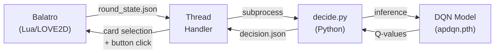

<div align="center">

# JoQer Engine — Deep Q Learning Agent for Balatro

**A reinforcement learning agent that autonomously plays [Balatro](https://store.steampowered.com/app/2379780/Balatro/), trained with Double DQN and integrated as a Steamodded mod.**

[](https://python.org)
[](https://pytorch.org)
[](https://www.lua.org)
[](https://store.steampowered.com/app/2379780/Balatro/)

</div>

---

<!-- ## Demo

<video src="mod-demo-small.mp4" controls="controls" style="max-width: 100%;"></video>

--- -->

## Overview

JoQer Engine hooks into Balatro's game loop and replaces human decision-making with a **Double Deep Q-Network**. The agent learns when to play and when to discard — and *which* discard strategy to use — by simulating thousands of poker hands in a custom environment.

| Feature | Description |
|---|---|
| Autonomous Play | Selects cards and clicks Play/Discard automatically |
| Double DQN | Reduces Q-value overestimation for stable learning |
| 6-Action Space | Play hand + 5 specialized discard strategies |
| Real-time Bridge | Lua-Python communication via JSON and LOVE threads |
| Full Hand Evaluation | Evaluates all C(8,5) = 56 combinations per hand |

---

## How It Works



1. **State Extraction** — `main.lua` hooks into `Game.update()` and serializes the current hand, remaining discards, and poker hand levels into `round_state.json`.

2. **Threaded Dispatch** — A LOVE2D thread (`decision_handler.lua`) spawns a Python subprocess for inference, keeping the game loop non-blocking.

3. **Neural Inference** — `decide.py` loads the trained DQN, encodes the hand as a 70-dimensional feature vector, and selects an action via argmax over Q-values.

4. **Action Execution** — The decision is written to `decision.json`, read back by Lua, and executed by programmatically clicking cards and buttons.

### Action Space

| Action | Strategy | Description |
|--------|----------|-------------|
| `0` | Play | Play the best 5-card hand from current cards |
| `1` | Flush Chase | Discard cards not matching the dominant suit |
| `2` | Keep Pairs | Discard singleton ranks, keep duplicates |
| `3` | Remove Weak | Discard low-rank cards without structural value |
| `4` | Straight + Pairs | Keep sequential runs and paired ranks |
| `5` | Composite Score | Discard lowest-scoring cards by composite metric |

### State Encoding (70-dim vector)

```
[52 card slots] + [13 rank counts] + [4 suit counts] + [discards_remaining]
```

---

## Architecture

### Model

```
Input (70) → Linear(128) → ReLU → Linear(128) → ReLU → Linear(6)
```

### Training Hyperparameters

| Parameter | Value |
|---|---|
| Episodes | 20,000 |
| Learning Rate | 1e-3 |
| Discount Factor (γ) | 0.9 |
| Epsilon (start → min) | 1.0 → 0.05 |
| Epsilon Decay | 0.9998 |
| Batch Size | 32 |
| Replay Buffer Size | 10,000 |
| Target Network Update | Every 100 episodes |
| Gradient Clipping | max_norm = 1.0 |

---

## Visualization

Training generates the following diagnostic plots via `plots.py`:

| Plot | What it shows |
|---|---|
| Training Reward | Raw + smoothed (200-ep window) reward curve |
| Score Distribution | Histogram with KDE of final hand scores |
| Score Over Time | Box plots per 1K-episode chunk |
| Action Distribution | Frequency of each strategy chosen |
| Reward vs Score | Scatter plot with regression line |
| Rolling Average Score | 200-episode rolling mean |

---

## Results

| Metric | Value |
|---|---|
| Avg Score (last 1K episodes) | — |
| Peak Score | — |
| Convergence Episode | ~5,000–8,000 |
| Dominant Actions | Typically action 2 (pairs) or 3 (weak removal) |

**Observations:**

- The agent learns to exhaust all discards before playing, maximizing hand improvement.
- Pair-keeping and weak-card removal tend to dominate the learned policy.
- Reward shaping (improvement-based for discards, score-based for final play) encourages incremental hand building.
- Playing early with discards remaining is penalized (`-0.03`), teaching the agent patience.

---

## Installation

### Prerequisites

- [Balatro](https://store.steampowered.com/app/2379780/Balatro/) on Steam
- [Steamodded](https://github.com/Steamodded/smods) mod loader
- Python 3.10+

### Steps

1. **Clone into Balatro's mod directory and Rename the folder:**

   ```bash
   cd "%APPDATA%/Balatro/Mods"
   git clone https://github.com/yourusername/joqer-engine.git
   Rename-Item -Path "joqer-engine" -NewName "JoQerEngine"
   ```

2. **Install dependencies:**

   ```bash
   cd JoQerEngine
   pip install -r requirements.txt
   ```

3. **Launch Balatro** — the mod loads automatically via Steamodded.

---

## Training

To retrain the model from scratch:

```bash
python decision_engine/train.py
```

This runs 20,000 episodes of simulated hands, trains a Double DQN with experience replay, displays diagnostic plots, and saves the model to `apdqn.pth`. Move the output file to the mod root for the game to pick it up.

---

## Project Structure

```
JoQerEngine/
├── main.lua                    # Steamodded entry — hooks Game.update()
├── decision_handler.lua        # LOVE2D thread — Lua/Python bridge
├── decide.py                   # Inference — loads model, outputs decision
├── dkjson.lua                  # JSON library for Lua
├── apdqn.pth                   # Trained model weights
├── JoQerEngine.json            # Mod metadata
├── requirements.txt            # Conda environment export
│
├── round_state.json            # [runtime] hand state  (Lua → Python)
├── decision.json               # [runtime] AI decision (Python → Lua)
│
└── decision_engine/
    ├── train.py                # Training loop (Double DQN + replay)
    ├── main.py                 # Smoke tests
    ├── plots.py                # Visualization suite
    ├── agent/
    │   ├── dqn.py              # Network (2×128 hidden layers)
    │   └── replay_buffer.py    # Experience replay buffer
    ├── env/
    │   └── game_env.py         # Simulated Balatro environment
    ├── logic/
    │   ├── evaluator.py        # Poker hand evaluator + scoring
    │   └── discard_strats.py   # 5 discard strategies
    └── utils/
        ├── cards.py            # Card representation & helpers
        └── encoding.py         # State → 70-dim vector encoder
```

---

## License

Open source under the [MIT License](LICENSE).

---

<div align="center">

*Built with PyTorch and a love for Balatro*

</div>
